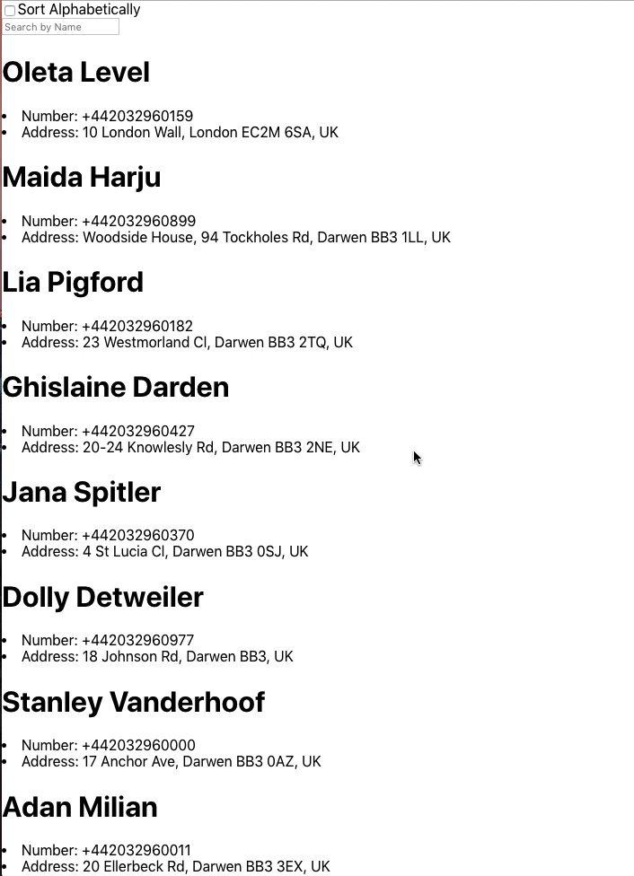

### `Introduction`

This was a code challenge on Hackajob, an external api was given, containing an array of phone contacts, the aim was to make a simple web app that would allow the user to search or sort the contact(s)

### `Getting started`

1) Clone this repositiory (obviously) 
2) Open the terminal, make sure you are on the correct directory 
3) type the command "npm install" to install the dependancies 
4) type "npm start" to boot up the local server.

### `Credits`

Semantic UI API - Checkbox & Input 
Hackajob Phonebook API 

